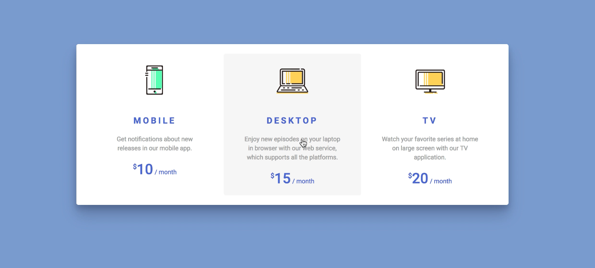

# Markup: Loop 01 - Step 01

## Design

## Implementation Challenges

### Handling SVG assets

Presented with svg assets, I needed to determine the method of
including those assets. I could inline them, but then my html file would
be slightly more difficult to traverse with the added lines of code. I
chose for this exercise to use an `img` tag and link the svg through the
`src` attribute.

### Aligning Items in a Flex Container

As you can see from the design specs, and what is commonly expected of
this UI pattern, the discrete parts of each _card_ are intended to line
up.

## What did I learn?

## How could I improve the UI?
