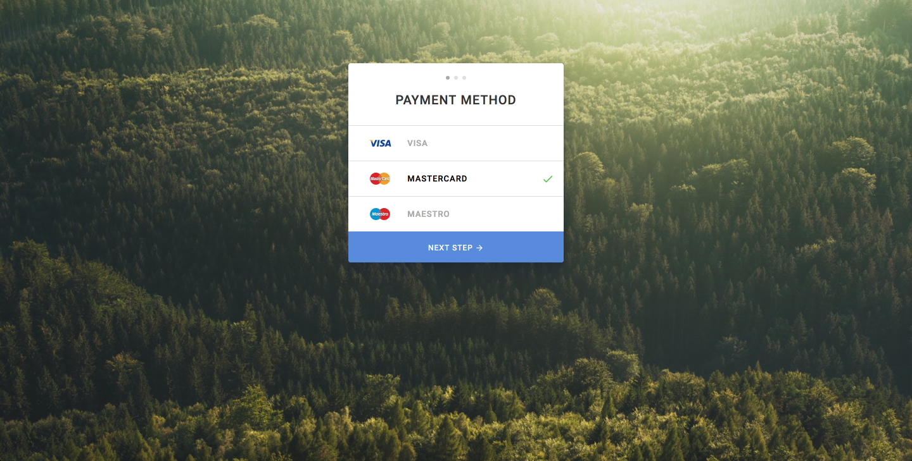

# Markup Loop 01 - Step 02

## Design

## Implementation Challenges

### Button Depression Animation

In the interactive mockup, it can be seen that the next step button is
supposed to behave like it is depressed when the user interacts with it.
In the video, it seems as though **only to top of the button moves down,
while the other edges remain still**. I found it difficult to achieve
this effect. I am able to depress the button but all sides of the button
move.

### Button Hides Container Border Radius

When adding the border radius to the containing `modal` component, the
bottom border radius seemed to be 'hidden' by the button. My solution
was to add border radius to the bottom corners of the button.

## What Did I Learn?

## How Could I Improve the UI?
