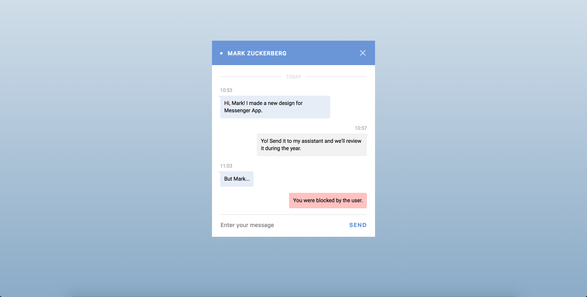

# Markup Loop 01 -Step 04

## Design

## Implementation Challenges

### Aligning Message Boxes

I found great difficulty in accomplishing the layout of the individual
message boxes. In my HTML structure, I wrapped the elements I was
calling `chat-box__message` in a containing div within the overall
_chat-box modal_. This of course resulted in the messages stretching
across the width of this container, which was not the desired effect.

After playing around in the **Fire Fox Developer Edition tools**, I came
across an apparent solution.

## What Did I Learn?

## How Could I Improve the UI?
